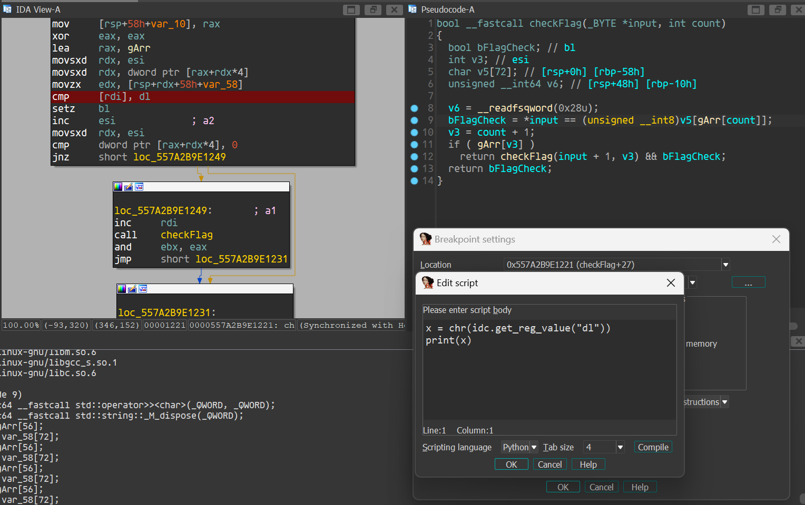

# Break The Syntax CTF 2024

## RE: Little Rusty
This was a mini VM challenge written in rust. The VM is relatively small, with only 9 opcodes. It is a fully stack based VM, with only 1 register used to keep track of the instruction pointer.
```c
struct vec {
  __int64 capacity;
  __int64 buf;
  __int64 len;
};

struct vmctx {
  vec inst;
  vec stack;
  __int64 pc;
};
```
The program first loads the code specified in the command line. 

### Load code
The function that was used to load the bytecode was `little_rusty::VM::load_program::h0b4f2ed26fa3d6c2`.

It unpacks the bytecode, maps each bytecode back into the VM's opcode, and push the new instruction set into the vector `vmctx->inst`

We can dump the memory in `vmctx->inst->buf` after this stage, to get the unpacked instructions.

### Instruction dispatcher
It then calls `little_rusty::VM::exec_next_instruction::h158e1efe8f1e4fd3` which handles the execution of each instruction in the `vmctx->inst` vector. The opcodes are as such:

> *Note: let `x` represent the element at the top of the stack*

| Opcode | Operand | Description |
| --- | --- | --- |
| `0x0` | {`value`} | push `value` into the stack | 
| `0x1` | - | pop from the stack | 
| `0x2` | - | print `x` | 
| `0x3` | {`value`} | `value` ^ `x` | 
| `0x4` | {`value`} | `value` + `x` | 
| `0x5` | {`value`} | `value` * `x` | 
| `0x6` | {`offset`} | jump relative (down): `pc` += `offset`| 
| `0x7` | {`offset`} | jump relative (up): `pc` -= `offset`| 
| `0x8` | - | nop | 

### Disassembly
With that, we can write a disassembler and analyse the program. It simply pushes a value to the stack, xor with a constant, and print it out. 
```python
from pwn import xor

with open("rustvm_inst", 'rb') as f:
    inst = f.read()

push_vals = []
xor_vals = []

for ip in range(0, len(inst), 2):
    match inst[ip]:
        case 0: # push
            push_vals.append(opr := inst[ip+1])
            print(f"{hex(ip)} push {hex(opr)}")
        case 1: # pop
            print(f"{hex(ip)} pop")
        case 2: # print
            print(f"{hex(ip)} print")
        case 3: # xor
            xor_vals.append(opr := inst[ip+1])
            print(f"{hex(ip)} xor {hex(opr)}")
        case 4: # add
            print(f"{hex(ip)} add {hex(inst[ip+1])}")
        case 5: # mul
            print(f"{hex(ip)} mul {hex(inst[ip+1])}")
        case 6: # jmp (down)
            off = inst[ip+1]
            print(f"{hex(ip)} jmp {hex(off)} --> {hex(ip + off + 1)}")
        case 7: # jmp (up)
            off = inst[ip+1]
            print(f"{hex(ip)} jmp {hex(off)} --> {hex(ip - off + 1)}")
        case 8: # nop
            print(f"{hex(ip)} nop")
        case _:
            print("error: not implemented")

print(f"Flag: {xor(push_vals, xor_vals)}")
```
The reason why the program is stuck after printing the flag header, is because of an infinite loop in the program. We can just analyse the program statically or remove the jump instruction to remove the loop.

Flag: `BtSCTF{Ru5t_r3v3rs1ng_b3_l1ke}`

## RE: Back to the future
We are given a program, which is a flag checker. It takes our input and passes into the `checkFlag` function at offset `0x4011FA`.

This function checks each byte of our input with an expected value in the register `dl`. This register's value is obtained from a stack variable, which was uninitialised. This stack variable was initialised at startup in one of the functions in `.init_array`. This function will then recursively call itself to check the next variable.

Set a breakpoint to read the values to get the flag.



Flag: `BtSCTF{THIS_BAD_BOY_CAN_FIT_SO_MUCH_UNDEFINED_BEHAVIOR}
`

*Note: Some values in the flag were corrupted, I just guessed the rest :)*