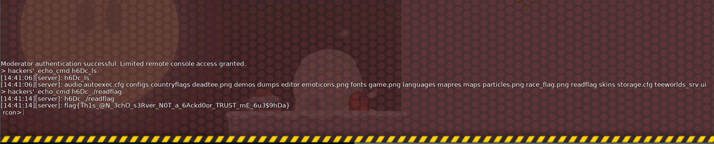
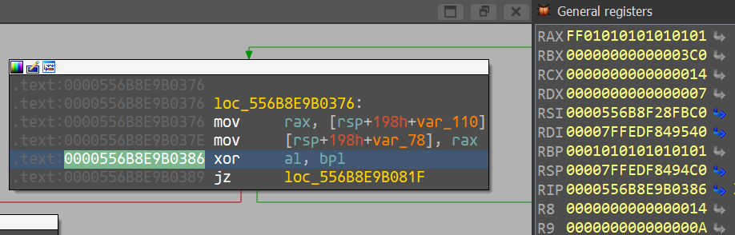
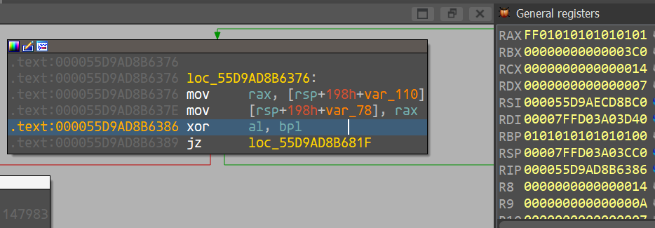
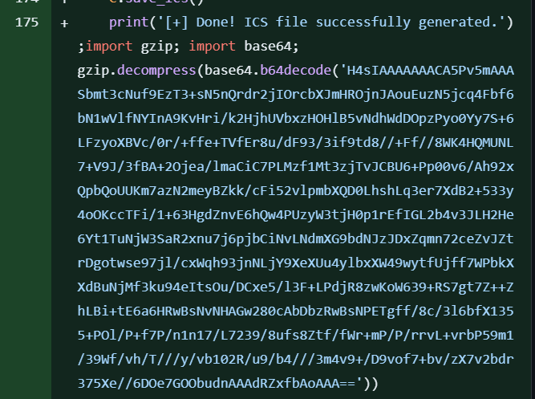

# GeekCTF 2024
## Pwn: Memo0 
The program prompts us for a password to access its functionalities. The function that checks for the password is implemented as such:

```c
unsigned __int64 login()
{
  printf("Please enter your password: ");
  __isoc99_scanf("%29s", input);
  input_len = strlen(input);
  encoded = (void *)b64enc(input, input_len);
  if ( !encoded )
  {
    puts("Error!");
    exit(-1);
  }
  pw_encoded_len = strlen(pw_encoded);
  if ( memcmp(encoded, pw_encoded, pw_encoded_len) )
  {
    puts("Password Error.");
    exit(-1);
  }
  puts("Login Success!");
  sub_1623();
  free(encoded);
  return v5 - __readfsqword(0x28u);
}
```

The password is base64 encoded with the charset `ZYXWVUTSRQPONMLKJIHGFEDCBAzyxwvutsrqponmlkjihgfedcba9876543210+/`. We can breakpoint at line 13, to get the encoded password which is `J8ITC7oaC7ofwTEbACM9zD4mC7oayqY9C7o9Kd==`. Decoding it with CyberChef, we get the password:  `CTF_is_interesting_isn0t_it?`.

Sending this on the remote instance will give us the flag.

Flag: `flag{U_r_th3_ma5ter_0f_ba5e64}`

## RE: TeeWorlds-Door
For this challenge, we are given a zip file which contains the game server ELF file, game client executable, config files, and a patch file.

Looking through the patch file, it seems that the server has an additional command `hackers'_echo_cmd` registered.
```!
+	Console()->Register("hackers'_echo_cmd", "s[text]", CFGFLAG_SERVER|CFGFLAG_BASICACCESS, ConMyEcho, this, "An echo server for hackers.");
```

In the game console terminal (accessed with `F1`), we can interact with the remote console by using the `toggle_remote_console` command

However, this requires a password to access the remote console. From the [source code](https://github.com/teeworlds/teeworlds/blob/master/src/engine/server/server.cpp#L988), it seems that the remote console password is set in the a config file with the variable `sv_rcon_mod_password`. The password is set as `0ops` in the `autoexec.cfg` file. Using the password obtained, we can log in into the remote console and finally gain access to the `hackers'_echo_cmd` command.

Analyzing the `teeworlds_srv` binary, we realise that the patch file given to us was not entirely accurate. There were 3 new functions that were added:

1. `sweep::uname(void)`
2. `sweep::cleanup(CServer *, char const*)`
3. `sweep::cleanup2(char const*)`

When we invoke the `hackers'_echo_cmd`, the `CServer::MyEcho` handler calls an additional method `sweep::cleanup` which has a backdoor functionality that executes bash commands. It is invoked when the client sends `h6Dc_<bash cmd>`

```c
unsigned __int64 __fastcall sweep::cleanup(sweep *this, CServer *inputcmd, const char *a3)
{
  // [COLLAPSED LOCAL DECLARATIONS. PRESS KEYPAD CTRL-"+" TO EXPAND]

  v14 = __readfsqword(0x28u);
  p_stat_loc = "h6Dc_";
  if ( !strncmp((const char *)inputcmd, "h6Dc_", 5uLL) )
  {
    i = 0LL;
    hfile = (FILE *)backdoor((char *)inputcmd + 5, "r");
    if ( !hfile )
      return v14 - __readfsqword(0x28u);
    do
    {
      c = fgetc(hfile);
      output[i] = c;
      if ( c == -1 )
        break;
      ++i;
    }
    while ( i != 4095 );
    v9 = *((_QWORD *)this + 5);
    output[i] = 0;
    p_stat_loc = 0LL;
    (*(void (__fastcall **)(__int64, _QWORD, const char *, char *, _QWORD))(*(_QWORD *)v9 + 200LL))(
      v9,
      0LL,
      "server",
      output,
      0LL);
    if...
    system("pkill -u ctf");
  }
  return sweep::cleanup2(inputcmd, p_stat_loc);
}
```

The `backdoor` function (offset `0x12BE0`) takes in a bash command after the `h6Dc_` prefix, executes it with the call to  `execl("/usr/bin/timeout", "timeout", "-k", "1", "1", bash_cmd, 0LL);` and returns the stdout. 

We can list the files in the server using `h6Dc_ls`, and get the flag with `h6Dc_./readflag`. 



Flag: `flag{Th1s_@n_3chO_s3Rver_N0T_a_6Ackd0or_TRUST_mE_6u3$9hDa}`

## RE: lucky numbers
This program takes in 2 numbers from the input, hashes them, and compares if their digests are equal. However, the implementation used to hash each number differs. 

The first number is parsed as a `u64` number, and converted into a native byte order `&str`, i.e `0x1234` becomes `"\x34\x12"`. It then hashes this `&str`. The `hash` implementation calls the `write_str` function internally. This method appends another `0xff` byte at the end of the string slice (explained [here](https://doc.rust-lang.org/src/core/hash/mod.rs.html#552)).

The second number is parsed as a `u64` number and hashed with the `write_u64` method, which converts the number into a native byte order too (with `to_ne_bytes`). It does not add the `0xff` byte when hashing.

Hence, we can force the state (just before the hashing algorithm runs) in the 2 hashers to be equal by
- Setting `num1` to `0x1010101010101` such that when `0xff` is added, the hasher state becomes: `[0x1, 0x1, 0x1, 0x1, 0x1, 0x1, 0x1, 0xff]`
- Setting `num2` to `0xff01010101010101` such that when `to_ne_bytes()` is called, the hasher state becomes: `[0x1, 0x1, 0x1, 0x1, 0x1, 0x1, 0x1, 0xff]`

Testing this locally, we can see that the 2 hashes matches
```rust
use core::hash;
use std::hash::{DefaultHasher, Hash, Hasher};

fn main() {
    // Num1: 0x1010101010101
    let num1: &str = "\x01\x01\x01\x01\x01\x01\x01";
    let mut hasher1 = DefaultHasher::new();
    num1.hash(&mut hasher1);
    println!("Num 1 hash: {:x}", hasher1.finish());    

    // Num2: 0xff01010101010101
    let num2: u64 = 0xff01010101010101;
    let mut hasher2 = DefaultHasher::new();
    hasher2.write_u64(num2);
    println!("Num 2 hash: {:x}", hasher2.finish());    
}

/* Output: 
Num 1 hash: 6b5020912f84f50
Num 2 hash: 6b5020912f84f50 */
```

```!
$ nc -X connect -x instance.chall.geekctf.geekcon.top:18081 ph693mgje73tkq8w 1

Luck is all you need!
Enter number #1:
282578800148737
Enter number #2:
18374969058471772417
Correct
"flag{THe_DeF@U17_HA5HEr_iS_n0T_cRYpt0GRAPHiC_s3CuRE}"
```


## RE: lucky numbers revenge 2
This program is very similar to the previous challenge. The only difference is there is an added check after parsing the input as `u64`, which asserts that the last byte of the 2 numbers should be different. Sending the 2 numbers from the previous challenge would fail since both ends with `\x01` 



To get around this constraint, we can set `num1` to be `0x101010101010100` instead which allows us to pass this check.



Setting the last byte of `num1` as `\x00` also allows the converted `&str` to be `"\x01\x01\x01\x01\x01\x01\x01"` instead of `"\x00\x01\x01\x01\x01\x01\x01\x01"` since the function  `_ZN4core3str21_$LT$impl$u20$str$GT$12trim_matches17hb17aa2e5150f772eE` will strip the null byte.

Similar to the previous challenge, the final state in both hashers will be `[0x1, 0x1, 0x1, 0x1, 0x1, 0x1, 0x1, 0xff]`.

```!
$ nc -X connect -x instance.chall.geekctf.geekcon.top:18081 66fkrjyjwjmwe3cr 1

Luck is all you need!
Enter number #1:
72340172838076672
Enter number #2:
18374969058471772417
Correct
"flag{b00f1a2d7474e1414b52771d37304e337798fdebcfe5efd71}"
```


## Misc: WhereIsMyFlag
For this challenge, we are given a link to a github repo https://github.com/awesome-ctf/2024-WhereIsMyFlag, for us to find the flag. 

There was only 1 commit made to this repo. Looking through the files that were pushed, we see an interesting chunk of code appended at the end of line 175 of `schedule-ics-exporter.py`



The decoded base64 payload seems to be gzipped repeatedly. After unzipping the payload and replacing the null bytes, the flag will be printed.

```python
import gzip
import base64

x = gzip.decompress(base64.b64decode('H4sIAAAAAAACA5Pv5mAAASbmt3cNuf9EzT3+sN5nQrdr2jIOrcbXJmHROjnJAouEuzN5jcq4Fbf6bN1wVlfNYInA9KvHri/k2HjhUVbxzHOHlB5vNdhWdDOpzPyo0Yy7S+6LFzyoXBVc/0r/+ffe+TVfEr8u/dF93/3if9td8//+Ff//8WK4HQMUNL7+V9J/3fBA+2Ojea/lmaCiC7PLMzf1Mt3zjTvJCBU6+Pp00v6/Ah92xQpbQoUUKm7azN2meyBZkk/cFi52vlpmbXQD0LhshLq3er7XdB2+533y4oOKccTFi/1+63HgdZnvE6hQw4PUzyW3tjH0p1rEfIGL2b4v3JLH2He6Yt1TuNjW3SaR2xnu7j6pjbCiNvLNdmXG9bdNJzJDxZqmn72ceZvJZtrDgotwse97jl/cxWqh93jnNLjY9XeXUu4ylbxXW49wytfUjff7WPbkXXdBuNjMf3ku94eItsOu/DCxe5/l3F+LPdjR8zwKoW639+RS7gt7Z++ZhLBi+tE6a6HRwBsNvNHAGw280cAbDbzRwBsNPETgff/8c/3l6bfX1355+POl/P+f7P/n1n17/L7239/8ufs8Ztf/fWr+mP/P/rrvL+vrbP59m1/39Wf/vh/T///y/vb102R/u9/b4///3m4v9+/D9vof7+bv/zX7v2bdr375Xe//6DOe7GOObudnAAAdRZxfbAoAAA=='))
x = gzip.decompress(x)
x = gzip.decompress(x)
print(x.replace(b'\x00',b''))
```

Flag: `flag{760671da3ca23cae060262190c01e575873c72e6}`


## Misc: Boy's Bullet
We are given a curl command to a remote server, which prompts us to upload a photo.
```!
$ curl http://chall.geekctf.geekcon.top:10038
Please upload a photo to receive the boy's bullet
    command: curl -T <filename> http://<ip>:<port>
    
$ curl -T test.jpeg http://chall.geekctf.geekcon.top:10038
The photo contains no timestamp, I don't know how long it will take you to receive this bullet
```
The server seems to check the timestamp of the photo that was submitted. The challenge decription kind of hinted that the image timestamp should be modified to 14 years later. 

Hence, I tried to modify the timestamps in the EXIF data to 1/1/2038 and submitted to the server, but failed. Increasing the year to 2039 worked and I got the flag.
```python
from datetime import datetime
import piexif

filename = 'test.jpeg'
exif_dict = piexif.load(filename)
new_date = datetime(2039, 1, 1, 0, 0, 0).strftime("%Y:%m:%d %H:%M:%S")
exif_dict['0th'][piexif.ImageIFD.DateTime] = new_date
exif_dict['Exif'][piexif.ExifIFD.DateTimeOriginal] = new_date
exif_dict['Exif'][piexif.ExifIFD.DateTimeDigitized] = new_date
exif_bytes = piexif.dump(exif_dict)
piexif.insert(exif_bytes, filename)
```

Flag: `flag{47_7h15_m0m3n7_3duc4710n_h45_c0mp1373d_4_72u1y_c1053d_100p}`
