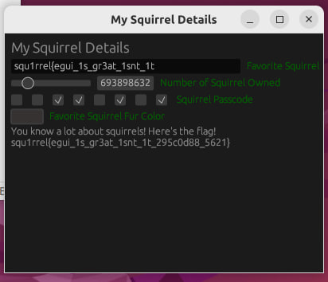

# squ1rrel CTF 2024

## RE: bin_fun
We are given a flag checker which is a self-modifying binary. It calls `mprotect` to set the segment from `0x401210`(`enc_code`) with `rwx` permissions.
```c
_int64 __fastcall main(int argc, char **argv, char **a3) {
  pgsize = getpagesize();
  addr = &enc_code - &enc_code % pgsize;
  if ( mprotect(addr, 2 * pgsize, PROT_EXEC|PROT_WRITE|PROT_READ) == -1 ) {
    puts("Failed to init");
    return 0xFFFFFFFFLL;
  }
  else {
    if ( (enc_code)(argv[1], (addr + 2 * pgsize)) )
      puts("Correct!");
    else
      puts("Incorrect!");
    return 0LL;
  }
}
```
In the encrypted part of the code, the program will unpack a block of instructions by xoring with a key. It then checks 1 byte from our input, xor it with another byte, and compare with a target value. If the check fails, the program will jump to `0x40121e` and return false. This sequence will repeat itself for every character of the flag. We can see this using Frida.

This set of instructions are is for unpacking the subsequent code blocks by xoring with `0x91`.
```
0x401229 mov rdx, rsi
0x40122c mov bl, byte ptr [rcx]
0x40122e xor bl, 0x91
0x401231 mov byte ptr [rcx], bl
0x401233 inc rcx
0x401236 cmp rcx, rsi
0x401239 jb 0x40122c
```
This set of instructions are used for validating 1 byte of our input.
```
0x40123b mov al, byte ptr [rdi] ----> Load 1 byte from input
0x40123d lea rcx, [rip + 0x12]
    // Unpacking code 
0x401256 xor al, 0xe7  -------------> Xor with key
0x401258 lea rcx, [rip + 0x12]
    // Unpacking code 
0x401271 cmp al, 0x94 --------------> Check with target value
0x401273 jne 0x40121e --------------> Fail path
```

To solve this challenge, we can hook all the instructions that are executed in the range where the encrypted instructions resides. We store all the xor keys in the second operand of `xor al, {key}` and the target value in `cmp al, {target}`. To ensure that we let the code unpack fully and not terminate early, we force the execution to not take the fail path at `0x40121e` by skipping the instruction. After the control flow exits from `main`, we can process the captured values and get our flag. 

Running `frida -f bin_fun AAA -l script.js`, we will get our flag: `squ1rrel{n1ce_r3v_sk3ll5_342897}`
```javascript
function inFuncRange(addr) {
    let func_start = Module.findBaseAddress('bin_fun').add(0x1222)
    let func_end = Module.findBaseAddress('bin_fun').add(0x210A)
    return addr >= func_start && addr <= func_end;  
}

let ct = [];
let key = [];
let main_addr = 0x1146
Interceptor.attach(Module.findBaseAddress('bin_fun').add(main_addr), {
    onEnter: () => {
        Stalker.follow(this.threadId, {
            transform(iterator){
                let insn = iterator.next()
                do{
                    if (inFuncRange(insn.address)) {
                        if (insn.toString().startsWith("jne 0x40121e")) {
                            continue; // skip the failed return insn
                        } else if (insn.toString().startsWith("xor al")) {
                            key.push(insn.operands[1].value);
                        } else if (insn.toString().startsWith("cmp al")) {
                            ct.push(insn.operands[1].value);
                        } 
                    }
                    iterator.keep();
                } while ((insn = iterator.next()) !== null);
            }
        })
    },
    onLeave: () => {
        Stalker.flush();
        Stalker.unfollow();
        let flag = "";
        ct.forEach((e, i) => {
            flag += String.fromCharCode(e ^ key[i]);
        });
        console.log(flag);
    }
});
```
## RE: rust_fun
This challenge is a rust challenge with a GUI interface. Luckily, it is not stripped and we are still able to infer some information about the binary.

The program gets 4 different inputs from the user, a text, integer, checkboxs and a colour. The goal of this challenge is to find the correct inputs to get the flag. To find the main handler (`core::ops::function::FnOnce::call_once$u7b$$u7b$vtable.shim$u7d$$u7d$::h59b21be340848367`) of this GUI interface, I did a x-ref on the string literal `'You know a lot about squirrels! Here's the flag!'`

In this main handler, we see that majority of the code is used for setting up the GUI elements for the inputs. In particular, we see 3 calls to `egui::ui::Ui::horizontal_with_main_wrap_dyn::h6aeddbea9090e80b`. Looking up [source code](https://github.com/emilk/egui/blob/f4d2aa5b4a7b221bb310d8f956694026ea8610c1/crates/egui/src/ui.rs#L1873) for the function, we see that it takes in an argument of type `FnOnce`, which is something like a lambda function in python, as the handler for the input element.

With that information, we can find these handlers:
| Function Name | Address | Description |
| --- | --- | --- |
| `core::ops::function::FnOnce::call_once$u7b$$u7b$vtable.shim$u7d$$u7d$::h2e2c5815318f135b` | 0xAB880 | Text input for Favourite Squirrel |
| `core::ops::function::FnOnce::call_once$u7b$$u7b$vtable.shim$u7d$$u7d$::h423b8184953eb9f0` | 0xABBD0 | Checkboxes input for Passcode |
| `core::ops::function::FnOnce::call_once$u7b$$u7b$vtable.shim$u7d$$u7d$::he27fc6ad68c8dba4` | 0xACF00 | Color picker for Fur Color | 

### Favorite Squirrel
Analyzing the code, we see that a bunch of constant values are loaded into the `xortarget`, and `xorkey` bytearray, and our input is being xored with the key and compared against the `xortarget`.   
```c
xortarget = xmmword_73B1C0;
v16 = 0x9868B1292D7B9699LL;
v17 = 0xBA6A6BC5;
v18 = 0x454B;
if ( *(_QWORD *)(v4 + 16) == 30LL ) {
    xorkey = xmmword_73B1D0;
    *(_QWORD *)&v27 = 0xA937C5481E09F1C6LL;
    DWORD2(v27) = 0xE51E05B6;
    WORD6(v27) = 0x317A;
    v5 = 30LL;
    if ( *(_QWORD *)(v4 + 16) < 0x1EuLL )
        v5 = *(_QWORD *)(v4 + 16);
    if ( v5 ) {
        v6 = *(_BYTE **)(v4 + 8);
        if ( (_BYTE)xortarget == (*v6 ^ (unsigned __int8)xorkey) ) {
            v7 = 0LL;
            while ( v5 - 1 != v7 ) {
                v8 = v7 + 1;
                v9 = *((_BYTE *)&xortarget + v7 + 1) == (unsigned __int8)(v6[v7 + 1] ^ *((_BYTE *)&xorkey + v7 + 1));
                ++v7;
                if ( !v9 )
                goto LABEL_18;
            }
            // ...
        }
        // ...
    }
    // ...
} 
```
Xoring the 2 constant arrays, we get the first part of the flag `squ1rrel{egui_1s_gr3at_1snt_1t`. If we input this into the program, the prompt text turns green indicating that our input was correct.

### Passcode
We see that the program derives a value from the checkboxes (`v3`) and checks if it is equal to 53.
```c
v4 = v3[7] | (2 * (v3[6] | (16 * (v3[2] | (4 * *v3) | (2 * v3[1]))) | (8 * v3[3]) | (4 * v3[4]) | (2 * v3[5])));
*a1[1] = v4 == 53;
if ( v4 == 53 ) {
    // check
}
```
Using iarybo, we can see that each checkbox represents 1 bit in a `byte` value. Hence, we just need to select the correct 'bits' such that the value makes up to 53 (`0b00110101`).
```
In [1]: v3 = [mba.var(f"v3_{i}_")&1 for i in range(8)]

In [2]: v3[7] | (2 * (v3[6] | (16 * (v3[2] | (4 * v3[0]) | (2 * v3[1]))) | (8 * v3[3]) | (4 * v3[4]) | (2 * v3[5])))
Out[2]:
Vec([
v3_7_0,
v3_6_0,
v3_5_0,
v3_4_0,
v3_3_0,
v3_2_0,
v3_1_0,
v3_0_0
])
```

### Fur Colour 
I saw a check with a constant at `0xACF48` which checks `cmp ecx, 313236h`. Nothing else in the function stood out to me. By some inference, this constant value has to signify a hex encoded colour value. Hence, picking the rgb value of (0x36, 0x32, 0x31) will give us the correct answer.

### Number of Squirrel Owned
In the main handler, I found that a slider element was initialised, and there was a check at `0xAC82B` for `cmp r13d, 295C0D88h`. `r13d` holds the value that we select from the slider. Hence, the correct value for this input is `693898632`

### Flag
Setting all the inputs, we'll get the flag: 



Flag: `squ1rrel{egui_1s_gr3at_1snt_1t_295c0d88_5621}`